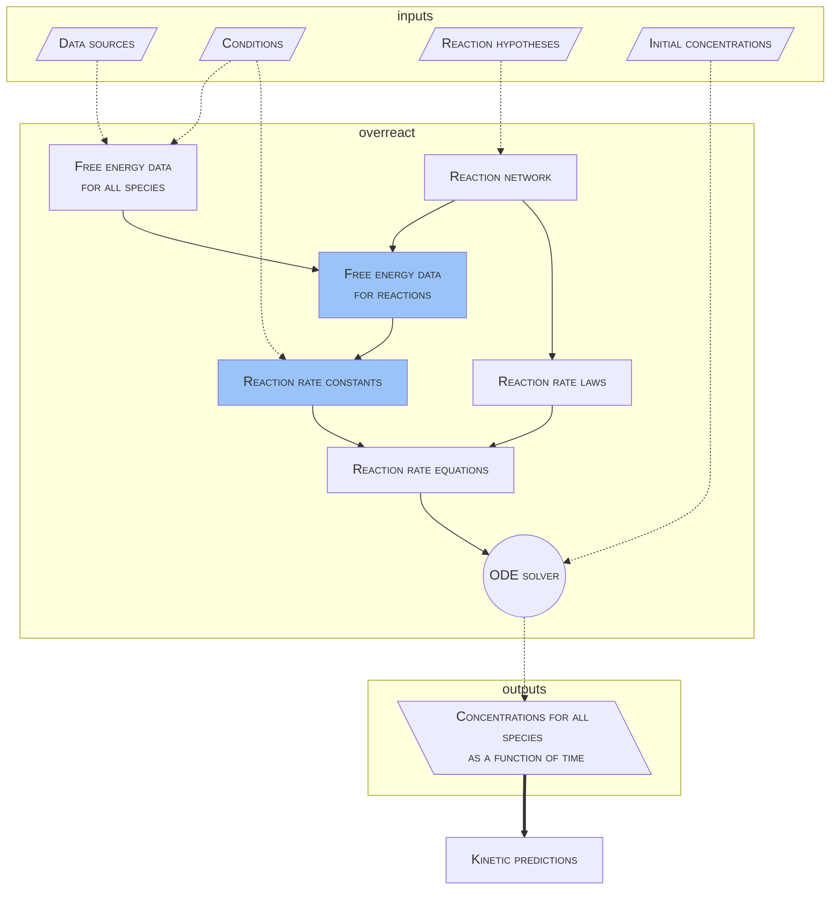

# How it works

**overreact** takes computational chemistry outputs as **data sources** and uses
them to calculate thermodynamic and kinetic properties as shown in the following
diagram.

**WARNING**: This above diagram greatly simplifies things. It is not a complete
description of the system and in no way substitutes the full read of the
upcoming paper.
