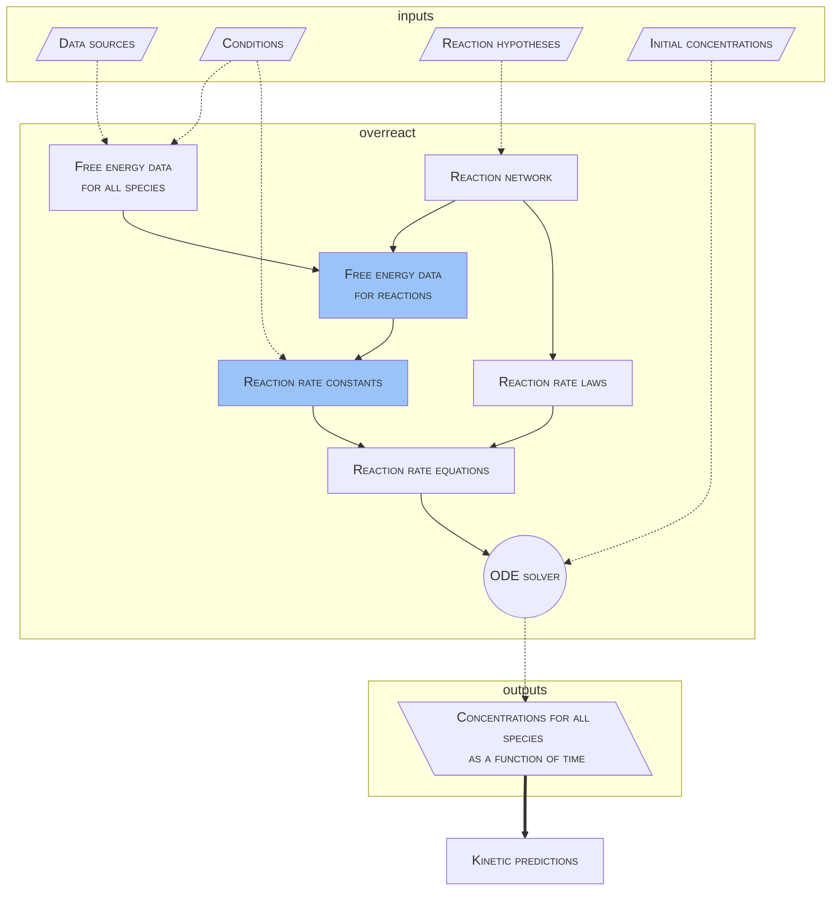

# How it works

**WARNIG**: This page greatly simplifies things. It is not a complete
description of the system and in no way substitutes the full read of
the upcoming paper.

**overreact** takes computational chemistry outputs as **data sources** and uses them to calculate thermodynamic and kinetic properties as shown in the following diagram.

\\[ \mu = \frac{1}{N} \sum_{i=0} x_i \\]

<!-- Currently, **overreact** only supports quantum chemistry outputs.
In the future we might get data from actual experiments, databases or using machine learning. -->

<!-- H -> hypo; -->

Free energies are calculated using the quasi-rigid rotor harmonic oscillator
method and the resulting data used in the automatic prediction of reaction
rate constants.
Quantum tunneling effects are taken into account using either the
Eckart or Wigner models.
Chemical reaction networks are subsequently simulated over time.

**Conditions** include temperature.

<!-- , pressure, and any other conditions that might be used in a simulation -->

Free energy data for reactions allow us to calculate reaction rates as `k(T, p)`.

Reaction rate equation laws are calculated using the **reaction rate equations** and are of the form `dy/dt(y)`.

Initial concentrations are given by the user as `y0[i]`.

**Concentrations for all species** are calculated using the **ODE solver** and are of the form `y[i, t]`.

The dictionary is then used to generate a plot.

The goal is to provide a tool for calculating thermodynamic properties of chemical systems.

By comparing calculated properties and kinetic predictions with actual experimental data, we refine our **hypotheses**.

<!-- ## Notes about thermodynamics -->

**overreact** employs standard statistical thermodynamical partition functions (the
Rigid Rotor Harmonic Oscillator), but also two Quasi-Rigid Rotor Harmonic
Oscillator approximations, one for entropy and one for enthalpy, for when
vibrational frequencies are too small.

A Head-Gordon damping is used for the treatment of QRRHO, which ensures the
standard procedure is used for frequencies well above
\\( 100 \text{cm}^{-1} \\).

See the treatments for entropy and enthalpy in the Jupyter Notebook about
QRRHO (TODO(schneiderfelipe): add link).%
