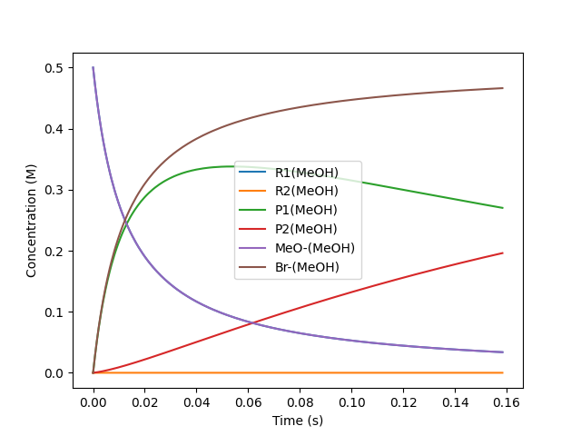
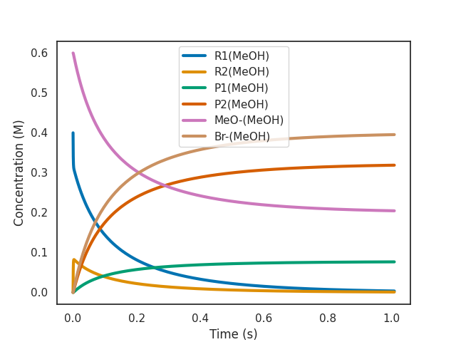

# Quickstart

This is a step-by-step guide on using overreact as a command-line tool. It will
teach you all the basics of overreact through a guided use-case.

<!-- # Usage examples

Some basic examples on how to use the command-line interface to solve simple
problems.

As an example, we're going to solve a
[Curtin-Hammett system](https://en.wikipedia.org/wiki/Curtin%E2%80%93Hammett_principle),
step-by-step. -->

\\[\require{mhchem}\\]

## A simple Curtin-Hammett system

We're going to explore a system that is simple enough to be a tutorial, but also
interesting enough to show off most of the capabilities of overreact. The
reaction is a classical SN\\(\_2\\) reaction on a substituted cyclohexane:

<div align="center">
    
</div>

**The labels above refer to the file names and the labels in the input file
below.** The steps above were calculated using GFN2-xTB by calling the
[Semiempirical Extended Tight-Binding Program Package](https://github.com/grimme-lab/xtb)
(XTB) from within [ORCA 4.2.1](https://orcaforum.kofo.mpg.de/app.php/portal).
Methanol was used as (implicit) solvent.

> **💡** You can [download a zip file of this tutorial](reaction-tutorial.zip)
> to run everything yourself.

## Step 1: Create the input file

[Inside the zip file](reaction-tutorial.zip), you'll find an input file called
`methoxylation.k`. It contains the following:

```
// methoxylation.k

// This is a comment.

$scheme
 // Here we define our reactions.
 R1(MeOH) <=> R2(MeOH)
 P1(MeOH) <=> P2(MeOH)
 R1(MeOH) + MeO-(MeOH) -> TS1#(MeOH) -> P1(MeOH) + Br-(MeOH)
 R2(MeOH) + MeO-(MeOH) -> TS2#(MeOH) -> P2(MeOH) + Br-(MeOH)
$end

$compounds
 // The path to the logfiles go here.
 R1(MeOH):   R1@MeOH/opt+numfreq.out
 R2(MeOH):   R2@MeOH/opt+numfreq.out
 P1(MeOH):   P1@MeOH/opt+numfreq.out
 P2(MeOH):   P2@MeOH/opt+numfreq.out
 MeO-(MeOH): MeO-@MeOH/opt+numfreq.out
 TS1#(MeOH): TS1@MeOH/b/optts+numfreq.out
 Br-(MeOH):  Br-@MeOH/singlepoint.out
 TS2#(MeOH): TS2@MeOH/b/optts+numfreq.out
$end
```

It describes the reactions and the compounds in the system (take a look at a
[more detailed description of the input format here](input.md)). The reactions
are almost an exact translation of the diagram above (observe the labels in the
figure are the same as in the input file).

> **✏️** Solvation is indicated by the parentheses at the end of compound names.
> As such, overreact adds corrections for solvation standard states to compounds
> such as `name(solv)`, **where `solv` is any identifier you want to use**. It
> is good practice to use an identifier that clearly identifies the chemical
> environment such as `name(MeOH)`.

After performing the calculations, obtaining the logfiles, and writing the input
file, _it's time to run overreact_.

## Step 2: Run overreact (or a tour over a typical output)

A first run of overreact would look like this:

```console
$ overreact methoxylation.k
```

This will produce quite an amount of output, so let's walk through it one step
at a time.

### 2.1: The header

The current version v1.0.2 produces a header like this:

```
╔═══════════════════════════════════════════════════════════════════════════════════════════════════════╗
║                                            overreact 1.0.2                                            ║
╚═══════════════════════════════════════════════════════════════════════════════════════════════════════╝

📈 Create and analyze chemical microkinetic models built from computational chemistry data.

Licensed under the terms of the MIT License. If you publish work using this software, please cite
doi:10.5281/zenodo.5730603:

┌───────────────────────────────────────────────────────────────────────────────────────────────────────┐
│                                                                                                       │
│ @misc{overreact2021,                                                                                  │
│   howpublished = {\url{https://github.com/geem-lab/overreact}},                                       │
│   year = {2021},                                                                                      │
│   author = {Schneider, F. S. S. and Caramori, G. F.},                                                 │
│   title = {                                                                                           │
│     \textbf{geem-lab/overreact}: a tool for creating and analyzing                                    │
│     microkinetic models built from computational chemistry data, v1.0.2                               │
│   },                                                                                                  │
│   doi = {10.5281/zenodo.5730603},                                                                     │
│   url = {https://zenodo.org/record/5730603},                                                          │
│   publisher = {Zenodo},                                                                               │
│   copyright = {Open Access}                                                                           │
│ }                                                                                                     │
└───────────────────────────────────────────────────────────────────────────────────────────────────────┘

Read the user guide at https://geem-lab.github.io/overreact-guide/ for more information and usage
examples. Other useful resources:

 • Questions and Discussions
 • Bug Tracker
 • GitHub Repository
 • Python Package Index

─────────────────────────────────────────────────────────────────────────────────────────────────────────
Inputs:

 • Path           = methoxylation.k
 • Concentrations = []
 • Verbose level  = 0
 • Compile?       = False
 • Plot?          = none
 • QRRHO?         = both
 • Temperature    = 298.15 K
 • Pressure       = 101325.0 Pa
 • Integrator     = Radau
 • Max. Time      = 86400
 • Rel. Tol.      = 1e-05
 • Abs. Tol.      = 1e-11
 • Bias           = 0.0 kcal/mol
 • Tunneling      = eckart
```

The important for us at the moment is the `Inputs` section. It contains all the
information that overreact needs to run the calculations, so that you can check
if it's doing what you want.

Then, after some logging, the program prints information on the parsed reactions
and compounds.

### 2.2: The reactions and compounds

For our example, the reactions are:

```
╭─────────────────────────────────────────────────────────────────╮
│                        (read) reactions                         │
│                                                                 │
│   R1(MeOH) <=> R2(MeOH)                                         │
│   P1(MeOH) <=> P2(MeOH)                                         │
│   R1(MeOH) + MeO-(MeOH) -> TS1#(MeOH) -> P1(MeOH) + Br-(MeOH)   │
│   R2(MeOH) + MeO-(MeOH) -> TS2#(MeOH) -> P2(MeOH) + Br-(MeOH)   │
│                                                                 │
╰─────────────────────────────────────────────────────────────────╯
                                (parsed) reactions

  no   reactant(s)             via‡         product(s)             half equilib.?
 ─────────────────────────────────────────────────────────────────────────────────
   0   R1(MeOH)                             R2(MeOH)                    Yes
   1   R2(MeOH)                             R1(MeOH)                    Yes
   2   P1(MeOH)                             P2(MeOH)                    Yes
   3   P2(MeOH)                             P1(MeOH)                    Yes
   4   R1(MeOH) + MeO-(MeOH)   TS1#(MeOH)   P1(MeOH) + Br-(MeOH)         No
   5   R2(MeOH) + MeO-(MeOH)   TS2#(MeOH)   P2(MeOH) + Br-(MeOH)         No

                     logfiles

  no   compound     path
 ────────────────────────────────────────────────
   0   R1(MeOH)     R1@MeOH/opt+numfreq.out
   1   R2(MeOH)     R2@MeOH/opt+numfreq.out
   2   P1(MeOH)     P1@MeOH/opt+numfreq.out
   3   P2(MeOH)     P2@MeOH/opt+numfreq.out
   4   MeO-(MeOH)   MeO-@MeOH/opt+numfreq.out
   5   TS1#(MeOH)   TS1@MeOH/b/optts+numfreq.out
   6   Br-(MeOH)    Br-@MeOH/singlepoint.out
   7   TS2#(MeOH)   TS2@MeOH/b/optts+numfreq.out
```

Here we have an opportunity to see the reactions disassembled and the species
classified into reactants, products, and transition states. We also classify
reactions as being part of an equilibrium reaction or not.

The next data involves the compounds.

### 2.3: The species

```
                                          compounds

  no   compound       elec. energy      spin mult.       smallest vibfreqs       point group
                         〈Eₕ〉                              〈cm⁻¹〉
 ────────────────────────────────────────────────────────────────────────────────────────────
   0   R1(MeOH)      -22.576340550900       1         +121.5,  +207.0,  +228.3       Cs
   1   R2(MeOH)      -22.575218880620       1         +111.9,  +174.2,  +238.2       Cs
   2   P1(MeOH)      -26.215281987160       1          +64.1,  +121.7,  +167.1       C1
   3   P2(MeOH)      -26.216556401840       1          +73.0,  +119.6,  +190.9       C1
   4   MeO-(MeOH)     -7.985271579600       1        +1133.7, +1177.9, +1179.5       C3v
   5   TS1#(MeOH)    -30.552250438240       1         -404.8,   +22.4,   +93.7       C1
   6   Br-(MeOH)      -4.435371316770       1                                         K
   7   TS2#(MeOH)    -30.558417149310       1         -451.8,   +55.7,   +86.2       C1

                             estimated thermochemistry (compounds)

  no   compound      mass         Gᶜᵒʳʳ            Uᶜᵒʳʳ            Hᶜᵒʳʳ              S
                    〈amu〉    〈kcal/mol〉     〈kcal/mol〉     〈kcal/mol〉    〈cal/mol·K〉
 ──────────────────────────────────────────────────────────────────────────────────────────────
   0   R1(MeOH)     163.06             80.57           103.35           103.94         78.38
   1   R2(MeOH)     163.06             80.63           103.21           103.80         77.73
   2   P1(MeOH)     114.19            105.68           129.35           129.95         81.39
   3   P2(MeOH)     114.19            105.63           129.38           129.98         81.64
   4   MeO-(MeOH)    31.03              9.96            23.18            23.77         46.33
   5   TS1#(MeOH)   194.09             99.20           127.78           128.37         97.85
   6   Br-(MeOH)     79.90             -8.27             0.89             1.48         32.70
   7   TS2#(MeOH)   194.09             99.77           127.83           128.42         96.11
```

Here we have the information about the compounds. overreact uses the electronic
energy, geometry, atomic masses,vibrational frequencies, charge and spin
multiplicity to obtain all it needs to run the calculations. In particular, the
point groups are obtained from the geometries and atomic masses. We see that the
\\(\ce{MeO-}\\) ion gets classified as \\(C\_{3v}\\) and both reactants are
\\(C_s\\). Then the next table shows the estimated thermochemistry for the
compounds.

Then comes the data about the reactions.

### 2.4: The reactions

The next two tables show the reaction thermochemistry.

```
                                                   estimated (reaction°) thermochemistry

  no   reaction                                        Δmass°        ΔG°            ΔE°            ΔU°            ΔH°             ΔS°
                                                       〈amu〉   〈kcal/mol〉   〈kcal/mol〉   〈kcal/mol〉   〈kcal/mol〉   〈cal/mol·K〉
 ──────────────────────────────────────────────────────────────────────────────────────────────────────────────────────────────────────────
   0   R1(MeOH) -> R2(MeOH)                              0.00           0.76           0.70           0.57           0.57           -0.66
   1   R2(MeOH) -> R1(MeOH)                              0.00          -0.76          -0.70          -0.57          -0.57            0.66
   2   P1(MeOH) -> P2(MeOH)                              0.00          -0.85          -0.80          -0.77          -0.77            0.25
   3   P2(MeOH) -> P1(MeOH)                              0.00           0.85           0.80           0.77           0.77           -0.25
   4   R1(MeOH) + MeO-(MeOH) -> P1(MeOH) + Br-(MeOH)    -0.00         -48.99         -55.87         -52.16         -52.16          -10.62
   5   R2(MeOH) + MeO-(MeOH) -> P2(MeOH) + Br-(MeOH)    -0.00         -50.60         -57.38         -53.50         -53.50           -9.71

                                                  estimated (activation‡) thermochemistry

  no   reaction                                        Δmass‡        ΔG‡            ΔE‡            ΔU‡            ΔH‡             ΔS‡
                                                       〈amu〉   〈kcal/mol〉   〈kcal/mol〉   〈kcal/mol〉   〈kcal/mol〉   〈cal/mol·K〉
 ──────────────────────────────────────────────────────────────────────────────────────────────────────────────────────────────────────────
   0   R1(MeOH) -> R2(MeOH)
   1   R2(MeOH) -> R1(MeOH)
   2   P1(MeOH) -> P2(MeOH)
   3   P2(MeOH) -> P1(MeOH)
   4   R1(MeOH) + MeO-(MeOH) -> P1(MeOH) + Br-(MeOH)     0.00          14.55           5.87           7.13           6.54          -26.86
   5   R2(MeOH) + MeO-(MeOH) -> P2(MeOH) + Br-(MeOH)     0.00          10.48           1.30           2.74           2.15          -27.94
```

The first table shows reaction free energies and its components. The second
table shows the activation energies and its components. Equilibria appear as
empty lines in the second table.

> **✏️** Observe that we show the 'mass variation' for each reaction in a
> dedicated column: **it should be full of zeroes**. It is a sanity check to
> make sure that the mass balance is satisfied, which is very useful for
> catching common mistakes.

Last, we have the kinetic data.

### 2.5: The kinetic data

```
                                                     estimated reaction rate constants

  no   reaction                                        half equilib.?         k                     k                      k           κ
                                                                        〈M⁻ⁿ⁺¹·s⁻¹〉   〈(cm³/particle)ⁿ⁻¹·s⁻¹〉   〈atm⁻ⁿ⁺¹·s⁻¹〉
 ──────────────────────────────────────────────────────────────────────────────────────────────────────────────────────────────────────────
   0   R1(MeOH) -> R2(MeOH)                                 Yes               1                     1                      1
   1   R2(MeOH) -> R1(MeOH)                                 Yes             3.63                  3.63                   3.63
   2   P1(MeOH) -> P2(MeOH)                                 Yes             4.16                  4.16                   4.16
   3   P2(MeOH) -> P1(MeOH)                                 Yes               1                     1                      1
   4   R1(MeOH) + MeO-(MeOH) -> P1(MeOH) + Br-(MeOH)         No              159                2.64e-19                  6.5         1.18
   5   R2(MeOH) + MeO-(MeOH) -> P2(MeOH) + Br-(MeOH)         No           1.56e+05              2.59e-16               6.38e+03       1.21

Only in the table above, all Gibbs free energies were biased by 0.0 J/mol.
For half-equilibria, only ratios make sense.
```

The last table shows the reaction rate constants in three different units. We
also have tunneling coefficients for convenience, but they are already included
in the kinetic data.

> **⚠️** The reaction rate constants for equilibrium reactions are not "genuine"
> rate constants: they are calculated such that the equilibrium constant is
> satisfied. This is used during the microkinetic simulations. **Only their
> ratios are meaningful**.

## Section 3: Microkinetic simulations

In order to perform a microkinetic simulation, all we have to do is add an
initial condition to the command line:

```
$ overreact methoxylation.k "R1(MeOH):0.4" "MeO-(MeOH):0.6"
```

Initial conditions are given as a list of species and their concentrations
separated by a colon.

> **✏️** The names are the same as in the input file and the concentrations are
> all in molar units.

A new section at the end of the output then appears:

```
     initial and final concentrations
                  〈M〉

  no   compound     t = 0 s   t = 0.05 s
 ────────────────────────────────────────
   0   R1(MeOH)       0.400        0.000
   1   R2(MeOH)       0.000        0.000
   2   P1(MeOH)       0.000        0.077
   3   P2(MeOH)       0.000        0.323
   4   MeO-(MeOH)     0.600        0.200
   5   TS1#(MeOH)     0.000        0.000
   6   Br-(MeOH)      0.000        0.400
   7   TS2#(MeOH)     0.000        0.000

Simulation data was saved to methoxylation.csv
```

Here we see a sketch of the initial and final concentrations of the species and
the approximate time when the reactions reach completion. A CSV file is created
with the simulation data automatically as well, with concentrations as function
of time. You can either analyze the data yourself or ask overreact to do a
simple plot of the data for you.

### 3.1: Plot of "active" species

The active species are the ones that actually change their concentration during
the simulation. You can ask overreact to plot them for you with the following
command:

```
$ overreact methoxylation.k "R1(MeOH):0.4" "MeO-(MeOH):0.6" --plot=active
```

> **💡** You can also request a plot of all species with the `--plot=all`
> option, or of a specific species with something like `--plot="P1(MeOH)"`.

The plot is shown immediately in a new window.



As we can see, the most abundant reactant at the beginning of the simulation is
the R1(MeOH). This leads to product P1(MeOH) being formed most of the time. But
P1(MeOH) rapidly interconverts to P2(MeOH) and then to R2(MeOH) and back

> **✏️** The customizations you can do in the command line are necessarily
> limited and serve mainly to help you explore the data. You can have full
> control over the plot, simulation parameters, and other factors by using the
> [overreact API directly](https://geem-lab.github.io/overreact/overreact.html).
> **Also, take a look at some of the [example notebooks](notebooks.md).**

#### 3.1.1: The effect of a bias

overreact allows one to apply a bias to the Gibbs free energy of all species.
This provides a way of counterbalancing systematic errors often found in
computed Gibbs free energies, but is also useful for exploring the sensitivity
of the generated profiles with respect to unknown error contributions.

In order to insert a bias, you can use the `--bias` option:

```
$ overreact methoxylation.k "R1(MeOH):0.4" "MeO-(MeOH):0.6" --plot=active --bias=-4.5
```

> **⚠️** Internally, overreact always uses joules/mol, but the bias is always
> given in kcal/mol for convenience.



As we can see from the plot above, a bias of -4.5 kcal/mol makes the reaction
2000x faster (as expected from \\(\exp(4.5 \text{ kcal$\cdot$mol$^{-1}$} / R T)
\approx 1989\\) at room temperature).
